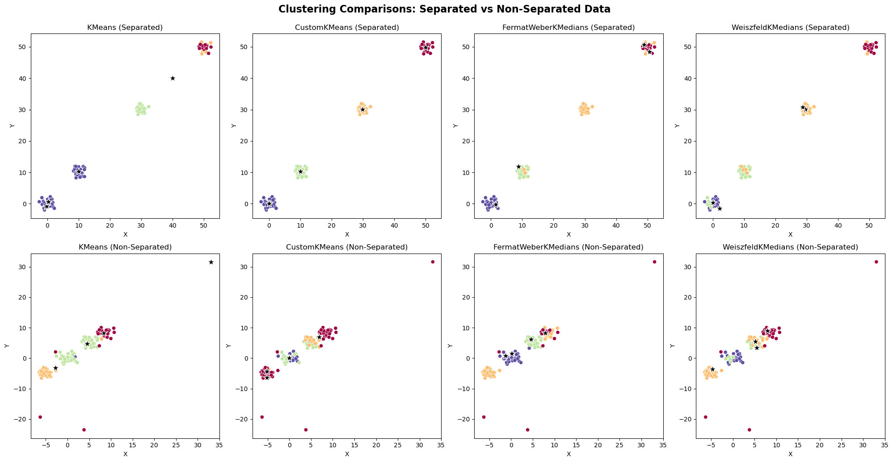

# Performance Comparison of K-Centroids Algorithms

#### Project Overview
This project compares the performance of four clustering algorithms on simulated datasets. The algorithms include:

1. **KMeans**: The traditional KMeans clustering algorithm that optimizes cluster centroids using the mean of data points within clusters.
2. **CustomKMeans**: A modified version of KMeans that adjusts the centroid updates to use weighted means based on distance to the centroids.
3. **FermatWeberKMedians**: This algorithm computes the centroids using the **Fermat-Weber problem**, which seeks the point that minimizes the sum of weighted distances to all points in the cluster.
4. **WeiszfeldKMedians**: This algorithm finds the **geometric median** (Fermat-Weber point) using the **Weiszfeld algorithm**, which iteratively updates the centroid to minimize the sum of Euclidean distances to the cluster points.

#### Problem Statement: Why KMeans Fails
KMeans can struggle with datasets that are non-linearly separable, especially when clusters have different variances or when there are outliers. Since KMeans optimizes based on the arithmetic mean, it can be sensitive to such noise. Using medians instead of means can provide robustness, especially in cases of outliers.

#### Objectives
We aim to explore how robust these algorithms are when applied to both separated and non-separated data, focusing on metrics such as the **Silhouette Score**, **Davies-Bouldin Index**, **Calinski-Harabasz Index**, and **Normalized Mutual Information (NMI)**. The **NMI** is included because we know the true cluster labels in our simulated datasets, allowing us to assess clustering performance relative to ground truth.

#### Formulas:
- **Silhouette Score**: Measures how similar a point is to its own cluster compared to other clusters.
  ```
  S = (b - a) / max(a, b)
  ```
  where `a` is the average intra-cluster distance, and `b` is the average nearest-cluster distance.
  
- **Davies-Bouldin Index**: Measures the average similarity ratio of each cluster to the cluster that is most similar to it.
  ```
  DBI = (1/k) * sum(max( (σ_i + σ_j) / d(c_i, c_j) ))
  ```
  where `σ_i` and `c_i` are the cluster dispersion and centroid, and `d(c_i, c_j)` is the distance between centroids.

- **Calinski-Harabasz Index**: Measures the ratio of the sum of between-cluster dispersion to within-cluster dispersion.
  ```
  CH = (trace(B_k) / trace(W_k)) * (n - k) / (k - 1)
  ```

- **NMI**: Evaluates clustering performance based on how much information about the true labels is captured in the predicted clusters.
  ```
  NMI(X, Y) = (2 * I(X; Y)) / (H(X) + H(Y))
  ```

#### Separated Data
For the separated dataset, we simulate four well-separated groups of data. The performance comparison is shown below:

| Algorithm            | Silhouette Score | Davies-Bouldin Index | Calinski-Harabasz Index | NMI     |
|----------------------|------------------|----------------------|-------------------------|---------|
| **KMeans**           | 0.570642         | 0.929926             | 242.571246              | 0.800687|
| **CustomKMeans**     | 0.903273         | 0.134421             | 14523.462463            | 1.000000|
| **FermatWeberKMedians** | 0.338425      | 0.839399             | 224.675486              | 0.726114|
| **WeiszfeldKMedians** | 0.187024        | 2.514328             | 211.985499              | 0.569861|

#### Non-Separated Data
For the non-separated dataset, the groups are closer together, with an outlier group that adds noise. Here are the results:

| Algorithm            | Silhouette Score | Davies-Bouldin Index | Calinski-Harabasz Index | NMI     |
|----------------------|------------------|----------------------|-------------------------|---------|
| **KMeans**           | 0.501290         | 0.456997             | 177.933406              | 0.696223|
| **CustomKMeans**     | 0.522352         | 0.954566             | 124.828006              | 0.750253|
| **FermatWeberKMedians** | 0.401144      | 0.713953             | 116.473917              | 0.750895|
| **WeiszfeldKMedians** | 0.352704        | 0.792708             | 104.364159              | 0.708963|

#### Plot Comparison
We generated the following plot to visually compare the clustering results across the four algorithms for both separated and non-separated data:



#### Interpretation of Results
- In the **separated dataset**, the **CustomKMeans** model outperforms all others, achieving perfect clustering based on the NMI and Silhouette Score. The **WeiszfeldKMedians** and **FermatWeberKMedians** perform worse, as the median-based approaches are less effective with well-separated, clean data.
  
- In the **non-separated dataset**, **CustomKMeans** and **FermatWeberKMedians** show better performance, with **WeiszfeldKMedians** trailing slightly behind. Here, the robustness of median-based algorithms helps manage the noise and closer clusters, demonstrated by relatively lower Davies-Bouldin scores and higher NMI.

#### Conclusion
This project highlights the relative strengths of median-based and mean-based clustering algorithms. While traditional KMeans and CustomKMeans excel in well-separated datasets, Fermat-Weber and Weiszfeld approaches demonstrate better robustness in non-separated data with noise. Future improvements could involve hybrid models that switch between mean and median-based strategies based on data characteristics.

### Citations:
Beck, A., & Sabach, S. (2015). Weiszfeld’s Method: Old and New Results. *Mathematics of Operations Research*. [Link to paper](https://ssabach.net.technion.ac.il/files/2015/12/BS2015.pdf)
